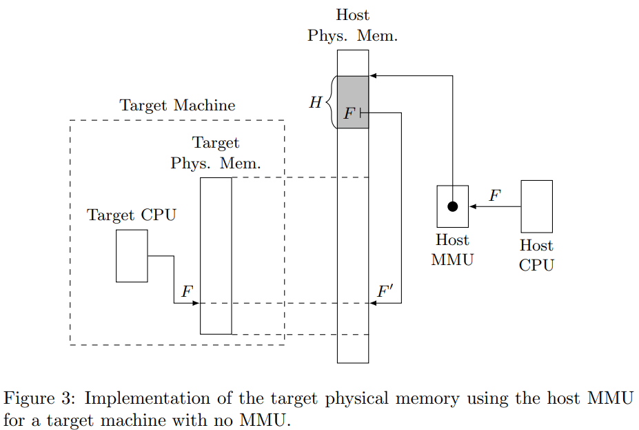

## 虚拟化的原理
在Dune一文中提到：

最简单的利用硬件实现虚拟化的方式是困住每一个获得privileged状态的指令。

这句话我没法理解，于是开始查阅相关资料去搞清楚这件事。

下面的内容摘自[CS140, Standford](https://web.stanford.edu/~ouster/cgi-bin/cs140-winter16/lecture.php?topic=vmm)：

Kernel calls in guest OS:
- User program running under guest OS issues kernel call instruction.
- Traps always go to VMM (not guest OS).
- VMM analyzes trapping instruction, simulates system call to guest OS:
- - Move trap info from VMM stack to stack of guest OS
- - Find interrupt vector in memory of guest OS
- - Switch simulated mode to "kernel"
- - Return out of VMM to interrupt handler in guest OS.
- When guest OS returns from system call, this traps to VMM also (illegal instruction in user mode); VMM simulates return to guest user level.

对于`VMM`我的了解并不充分，查阅得到下面的[资料](https://lettieri.iet.unipi.it/virtualization/2018/hardware-assisted-vmm.pdf)：

`VMM`的原理：
- `VMM`将虚拟`CPU`的状态信息送入物理机处理器内，让物理机运行目标代码，直到运行至无法继续直接运行的指令。
- `VMM`重新掌控宿主机，将`CPU`状态写入虚拟`CPU`数据结构中，根据该信息在虚拟机软件中模拟执行目标代码。执行完毕回到第一步，周而复始。

在宿主的`CPU`执行客户程序时，客户也不能完全掌握宿主：宿主机有能力检测并且强制控制权转换给`VMM`，让`VMM`去做模拟。这种`traps`客户是不知道的。

因此，这里有个上下文切换游戏，宿主机的CPU在目标软件和VMM之间切换。目标软件`tra`p时`VMM`就掌权。

这个过程和`user mode`与`kernel mode`切换有异曲同工之妙。这里也告知我们，`VMM`是由很高的权限的，它可以是爸爸。
### 与`kernel mode`存在的异同？
`kernel mode`只能虚拟化一些用户空间可见的东西，而`VMM`能够调用`VM`中被虚拟化的整个处理器。此外，`%cr3`和`%idtr`是可以被客户机内核访问的，这个东西`kernel mode`则会制止。

### Trap何时出现？
我们要保证虚拟机状态Virtual Machine和目标机状态Target Machine的一致性。考虑到寄存器信息一直可以通过`load CPU state`的方式转移，保持该一致性这并不是很大的问题。关键要考虑一下内存相关的知识。
#### 内存映射：

图中所示为target Physical Memory（其实就是虚拟机器里头的东西）的模拟过程。灰色的东西是页表存储的地方，宿主机的MMU通过页表映射提供给虚拟机一个自己拥有很大很大物理内存的假象。

#### I/O
在宿主机运行客户机代码时，I/O指令被宿主机CPU得知，其将会采用`trap`，转换状态为`VMM`，让`VMM`做I/O模拟工作。`VMM`是由能力直接和宿主机的外设进行交流的，但是其并不能做到直接或者方便地使用。

对于将`RAM`中的信息写入外设的指令（比如写到U盘之中），也需要`trap`，该`trap`被捕获后VMM也是能够完成类似工作的，只要`marking not-present pages that contain such addresses`。

#### 中断的模拟
由于VM很大，其自带中断描述表，这个表格受到虚拟机里的OS影响。

执行步骤如下：
- 查阅客户机中断门（通过中断门得到终端描述表）
- 在客户机的栈中存好当前状态
- 根据中断门信息修改客户机的`instruction pointer`指向（修改PC，即控制流信息）

在下一次客户机的状态被装载到宿主机时，虚拟机中的中断将会得到处理。

Note the VMM must
know when the guest disables and enables the interrupts: if the guest interrupts
are disabled, the VMM must wait until they are enabled again before emulating
the interrupt reception. This can be achieved, for example, if the host CPU is
capable of trapping the instructions that manipulate the interrupt-enable flag.